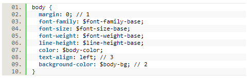
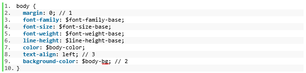
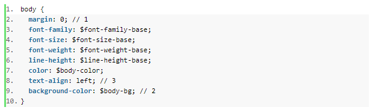

---
---

<html lang="en">
<head>
	<meta charset="utf-8">
	<title>SyntaxHighlighter</title>
	<link href="{{ site.baseurl }}/css/theme.css" rel="stylesheet">
	
</head>
<body>
	<h1>Syntax Highlighter</h1>
	
Format HTML, JavaScript and CSS for use in documentation like Microsoft Word or Google Docs.

	
Paste your code into the text area below, choose your format type and click the Format button.

	
	<select class="custom-select">
		<option value="html" selected>HTML</option>
		<option value="javascript">JavaScript</option>
		<option value="css">CSS</option>
	  </select>
	<button id="btn">Format</button><button id="copy" data-clipboard-action="copy" data-clipboard-target="div.dp-highlighter">Copy</button> 
	<textarea name="input" cols="100" rows="10"></textarea>
	

	<h2>Examples</h2>
	

	<h5>Screenshot of CSS formatting</h5>
	
	<h5>Paste into Microsoft Word</h5>
	
	<h5>Paste into Google Docs</h5>
	

	
	 
	 
	
	

	
	
Using a customized version of the most excellent <a href="https://github.com/syntaxhighlighter/syntaxhighlighter">SyntaxHighlighter</a> library 🥰

</body>
</html>